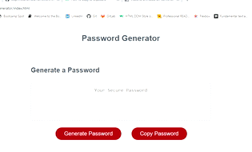

## General Information

The deployed Webpage is a password generator and the application displays an example how to use Java Script and its functionality. The generator allows the user to click on a button and will be asked if they want the password to include certain criteria which determines the password. 

The application is deployed to GitHub Pages. Please click here to go to the deployed webpage: 

[Password-Generator](https://zahramertens.github.io/Password-Generator/)

## Table if Contents
1. [General Information](#general-informaion)
2. [Task Description](#task-description)
3. [Actual Behaviour](#actual-behaviour)
4. [Bonus](#bonus)
5. [Mock-Up](#mock-up)
6. [Credits](#credits)

## Task Describtion

The task/homework was to update a given Java Script file to give the page functionaliy. There was a starter code to create an application that enables employees to generate random passwords based on criteria that we have selected. As an employer with access to secure data I want to be able to create randomly created passwords that meet certain criteria to provide greater security.

**Note:** This app will run in the browser and will feature dynamically updated HTML and CSS powered by JavaScript code.

## Actual Behaviour

* When the user clicks on the button to generate a password the browser will present a series of prompts with criterias that can/must be selected.

* The first promt will ask the user of the preffered password length (Between 8-128) and the user needs to enter a number and press "OK"

* If the user presses "Cancel" the app will tell the user that the password length needs to be defined.

* If the user enters a number lower than 8 and above 128 the app tells the user that the length must be between 8 and 128.

* If the number entered us valid, the browser will ask if the user wants the password to include lower case letters, upper case letters, numbers and/or special characters. If all criteria selected correct, than the password will appear in the text box and be exactly how the user wants it to be.

* If the user does not select any of the criteria the browser will tell the user that at least one criteria must be selected.

## 🏆 Bonus

* There us a new button that allows the user to copy the created password. If the user creates a password the text will be displayed in the input field and if the button is clicked the text will be copied and an alert will confirm the copied text.

## Mock-Up

The following GIF shows the web applications apperance and functionality:

## Credits

https://www.w3schools.com/
https://www.w3schools.com/jsref/jsref_push.asp
https://developer.mozilla.org/en-US/docs/Web/JavaScript/Reference/Global_Objects/Array/join
https://stackoverflow.com/questions/1349404/generate-random-string-characters-in-javascript
